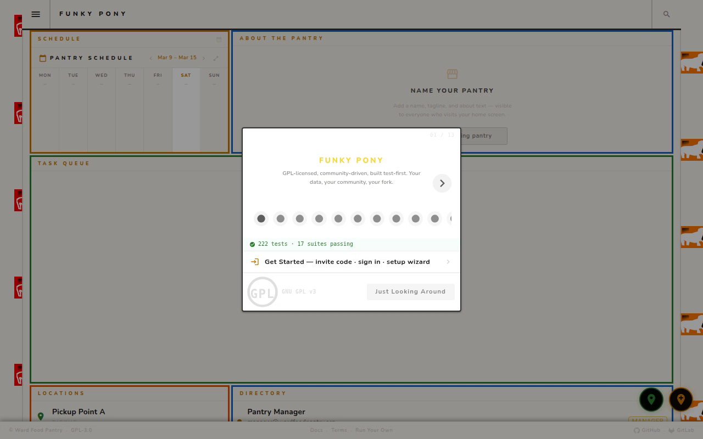
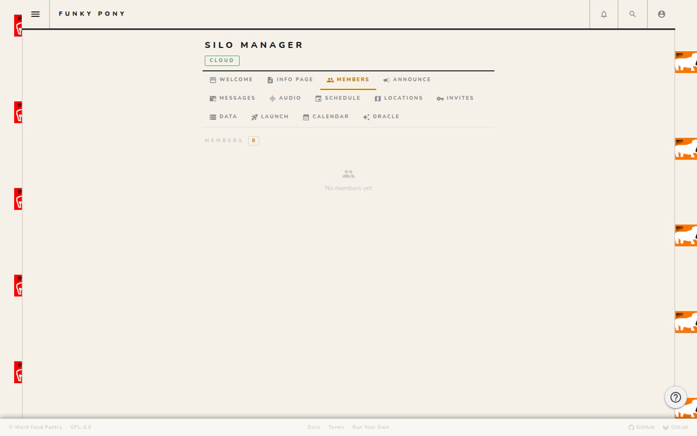
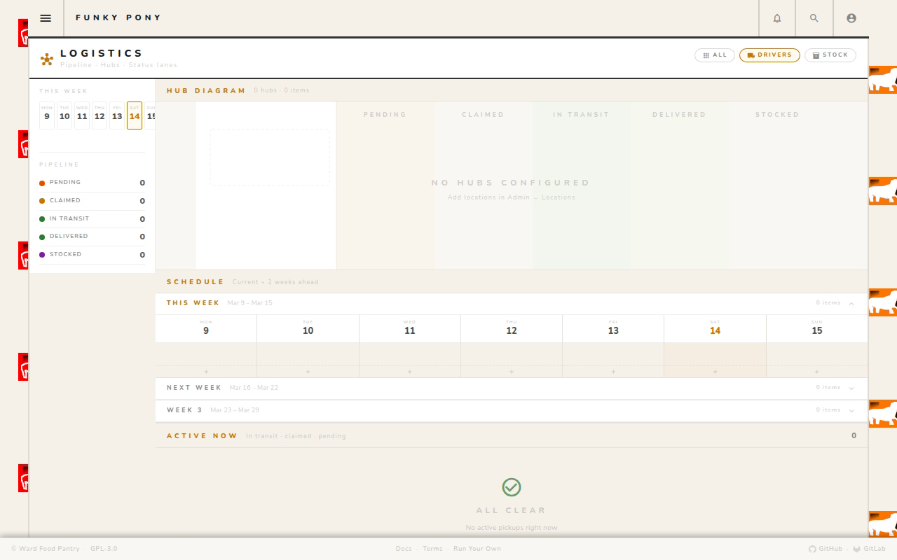
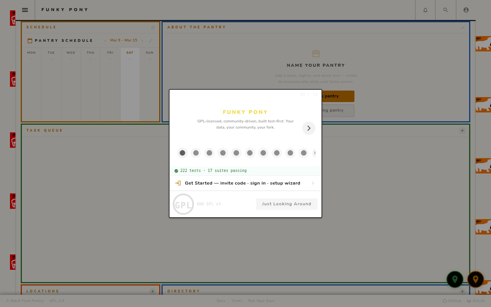

# Funky Pony Pantry

**Community food pantry coordination with full data autonomy.**

[](https://www.gnu.org/licenses/gpl-3.0)
[](https://vuejs.org)
[](https://quasar.dev)
[](#testing)

A GPL-licensed, local-first food pantry coordination platform. Track needs, coordinate pickups, manage volunteers, and share resources — all while keeping each community in full control of their own data. Runs entirely offline by default; cloud sync via Supabase or Appwrite is additive and optional.

**Ward Food Pantry** (Ward, CO) is the first live deployment: [ward.funkypony.space](https://ward.funkypony.space)

---

## Deploy

**New to the project? Use the guided wizard — it collects your credentials step by step and generates a ready-to-paste `.env` file.**

[](https://biomassives.github.io/funkypony/)

Covers Vercel, Netlify, Cloudflare Pages, Nile multi-tenant DB, Heroku Postgres, Mailgun, and Twilio — all in one place.

**Quick deploy (you'll need your keys ready):**

| Platform | Button |
|----------|--------|
| **Vercel** (+ Supabase) | [](https://vercel.com/new/clone?repository-url=https://github.com/biomassives/foodbank&env=VITE_SUPABASE_URL,VITE_SUPABASE_ANON_KEY&envDescription=Supabase+project+keys&project-name=funky-pony-pantry) |
| **Netlify** (+ Supabase) | [](https://app.netlify.com/start/deploy?repository=https://github.com/biomassives/foodbank) |
| **Appwrite** (self-sovereign) | [→ Appwrite Deployment Guide](docs/appwrite-deployment.md) |
| **Local only** | Clone + `npm install` + `quasar dev` — no keys needed |

---

## Table of Contents

- [App in Action](#app-in-action)
- [What Is This?](#what-is-this)
- [Quick Start](#quick-start)
- [Routes & Pages](#routes--pages)
- [Features](#features)
- [Architecture](#architecture)
- [Deployment](#deployment)
- [Edge Functions](#edge-functions)
- [Data Model](#data-model)
- [Internationalization](#internationalization)
- [Testing](#testing)
- [Agent API](#agent-api)
- [Contributing](#contributing)
- [License](#license)

---

## App in Action

Live browser walkthroughs recorded by Puppeteer during e2e test runs — every frame is the real app, no mock data.
**[Browse all recordings →](https://www.funkypony.space/recordings)**

<table>
  <tr>
    <td align="center" width="50%">
      <a href="https://www.funkypony.space/recordings">
        
      </a>
      <br><br>
      <strong>Public Visitor Tour</strong><br>
      Homepage · /info · /calendar · /docs · /launch · /join<br>
      <br>
      <a href="https://www.funkypony.space/recordings">▶ Watch</a>
      &nbsp;·&nbsp;
      <a href="https://github.com/biomassives/foodbank/issues/new?title=%5BRecording%5D+Public+Visitor+Tour&labels=feedback&body=**Recording%3A**+public-visitor.mp4%0A**Page%3A**+https%3A%2F%2Fwww.funkypony.space%2Frecordings%0A%0A**Feedback%3A**%0A">GitHub issue</a>
      &nbsp;·&nbsp;
      <a href="https://gitlab.com/foodpantry/ward/-/issues/new?issue%5Btitle%5D=%5BRecording%5D+Public+Visitor+Tour&issue%5Bdescription%5D=Recording%3A+public-visitor.mp4%0APage%3A+https%3A%2F%2Fwww.funkypony.space%2Frecordings%0A%0AFeedback%3A%0A">GitLab issue</a>
    </td>
    <td align="center" width="50%">
      <a href="https://www.funkypony.space/recordings">
        
      </a>
      <br><br>
      <strong>Admin Full Tour</strong><br>
      SILO MANAGER · all tabs · Oracle E8 ZK Lattice visualizer<br>
      <br>
      <a href="https://www.funkypony.space/recordings">▶ Watch</a>
      &nbsp;·&nbsp;
      <a href="https://github.com/biomassives/foodbank/issues/new?title=%5BRecording%5D+Admin+Full+Tour&labels=feedback&body=**Recording%3A**+admin-tour.mp4%0A**Page%3A**+https%3A%2F%2Fwww.funkypony.space%2Frecordings%0A%0A**Feedback%3A**%0A">GitHub issue</a>
      &nbsp;·&nbsp;
      <a href="https://gitlab.com/foodpantry/ward/-/issues/new?issue%5Btitle%5D=%5BRecording%5D+Admin+Full+Tour&issue%5Bdescription%5D=Recording%3A+admin-tour.mp4%0APage%3A+https%3A%2F%2Fwww.funkypony.space%2Frecordings%0A%0AFeedback%3A%0A">GitLab issue</a>
    </td>
  </tr>
  <tr>
    <td align="center" width="50%">
      <a href="https://www.funkypony.space/recordings">
        
      </a>
      <br><br>
      <strong>Driver &amp; Logistics Workflow</strong><br>
      Hub diagram · pipeline lanes · DRIVERS / STOCK filters<br>
      <br>
      <a href="https://www.funkypony.space/recordings">▶ Watch</a>
      &nbsp;·&nbsp;
      <a href="https://github.com/biomassives/foodbank/issues/new?title=%5BRecording%5D+Driver+%26+Logistics+Workflow&labels=feedback&body=**Recording%3A**+driver-logistics.mp4%0A**Page%3A**+https%3A%2F%2Fwww.funkypony.space%2Frecordings%0A%0A**Feedback%3A**%0A">GitHub issue</a>
      &nbsp;·&nbsp;
      <a href="https://gitlab.com/foodpantry/ward/-/issues/new?issue%5Btitle%5D=%5BRecording%5D+Driver+%26+Logistics+Workflow&issue%5Bdescription%5D=Recording%3A+driver-logistics.mp4%0APage%3A+https%3A%2F%2Fwww.funkypony.space%2Frecordings%0A%0AFeedback%3A%0A">GitLab issue</a>
    </td>
    <td align="center" width="50%">
      <a href="https://www.funkypony.space/recordings">
        
      </a>
      <br><br>
      <strong>Login &amp; Role Workflows</strong><br>
      Sign-in · role gating · admin tabs · sign-out<br>
      <br>
      <a href="https://www.funkypony.space/recordings">▶ Watch</a>
      &nbsp;·&nbsp;
      <a href="https://github.com/biomassives/foodbank/issues/new?title=%5BRecording%5D+Login+%26+Role+Workflows&labels=feedback&body=**Recording%3A**+login-role-workflows.mp4%0A**Page%3A**+https%3A%2F%2Fwww.funkypony.space%2Frecordings%0A%0A**Feedback%3A**%0A">GitHub issue</a>
      &nbsp;·&nbsp;
      <a href="https://gitlab.com/foodpantry/ward/-/issues/new?issue%5Btitle%5D=%5BRecording%5D+Login+%26+Role+Workflows&issue%5Bdescription%5D=Recording%3A+login-role-workflows.mp4%0APage%3A+https%3A%2F%2Fwww.funkypony.space%2Frecordings%0A%0AFeedback%3A%0A">GitLab issue</a>
    </td>
  </tr>
</table>

---

## What Is This?

→ [Community explainer for partners and volunteers](docs/funky-pony-explainer.md)

→ [In-app documentation at /docs](src/pages/DocsPage.vue) (browse at `your-deployment.example.com/docs`)

Funky Pony Pantry is a web app for coordinating food pantry operations end-to-end:

- **Members** browse the community board, post needs and offerings, and check pantry hours
- **Drivers** claim pickup runs from the queue and track deliveries to completion
- **Stock crew** receive deliveries and mark items stocked
- **Admins** manage the full org: members, locations, schedule, announcements, invites, and data

Every feature works in local mode (IndexedDB only). Cloud sync is turned on when you connect a Supabase or Appwrite project.

---

## Quick Start

### Option A — Local Only (no database needed)

```sh
git clone https://github.com/biomassives/foodbank.git
cd foodbank
npm install
quasar dev
```

Open `http://localhost:9000`, click **Start Now — Free & Local**. Done.

### Option B — Cloud Sync (Supabase)

```sh
cp .env.example .env.local
# Edit .env.local:
#   VITE_SUPABASE_URL=https://xxxx.supabase.co
#   VITE_SUPABASE_ANON_KEY=eyJ...
quasar dev
```

Run migrations in the Supabase SQL Editor from `supabase/migrations/` in order, then deploy the four edge functions. See [Deployment](#deployment).

### Option C — Appwrite

See [docs/appwrite-deployment.md](docs/appwrite-deployment.md).

---

## Routes & Pages

| Route | Page | Access |
|-------|------|--------|
| `/` | Home — directory, queue, entries | Public |
| `/info` | Pantry info page (hours, location, community board) | Public |
| `/calendar` | 12-week rolling calendar | Public |
| `/calendar-rules` | Calendar rule editor (recurring events) | Admin / editor |
| `/logistics` | Live dispatch hub diagram | Logged in |
| `/docs` | In-app documentation | Public |
| `/mcp-docs` | MCP & Chat Ops guide | Public |
| `/recordings` | Puppeteer test recording gallery | Public |
| `/tests` | Live test results dashboard | Public |
| `/profile` | My profile + Needs & Items board | Logged in |
| `/settings` | Preferences, export/import, locale | All |
| `/admin` | Admin panel (all tabs) | Admin only |
| `/setup` | Supabase setup wizard | Admin / localMode |
| `/join` | Join with invite code | Public |
| `/onboard` | Get started — 3 paths | Public |
| `/terms` | Terms & conditions | Public |
| `/launch` | Run your own pantry | Public |
| `/wizard` | Guided setup wizard | Public |
| `/audio` | Audio sequence builder | All |

---

## Features

### Core

- **Local-first storage** — IndexedDB via `idb`; everything works offline
- **Cloud sync** — optional Supabase / Appwrite real-time sync
- **Invite-only join** — admin creates a code with a role; volunteer enters code + email; magic link signs them in with role pre-assigned
- **Role-based access** — `admin`, `driver`, `stock_pantry`, `logistics_outreach`, `member`

### Operations

- **Pickup Queue** — `pending → claimed → in_transit → delivered → stocked` pipeline with per-entry thumbnails
- **Logistics View** (`/logistics`) — SVG hub diagram with bezier lanes, week strip schedule dots, role filter chips (ALL / DRIVERS / STOCK)
- **12-week Calendar** — auto-generated from location schedules; merges pantry hours, location events, staged messages, and tasks
- **Location Management** — add hubs with recurring day schedules; calendar regenerates on save

### Community

- **Needs & Items Board** — drag-and-drop four-bin board per member profile: AVAILABLE / EXPECTED / OFFERED / NEED; privacy eye for anonymous posting; community feed at bottom
- **Public Info Page** (`/info`) — admin-authored sections + schedule + community needs; no login required
- **Announcements / MTS** — compose targeted messages to roles; Stage Draft → Schedule & Queue → Send Now via Mailgun

### Admin

- **Admin Panel** — WELCOME / INFO PAGE / MEMBERS / ANNOUNCE / SCHEDULE / LOCATIONS / INVITES / DATA / LAUNCH / CALENDAR / ORACLE tabs
- **Export & Import** — download all contacts, entries, locations + settings keys as JSON; import merges non-destructively
- **Setup Wizard** — step-by-step first-time setup: Supabase credentials, secrets, edge function deploy with probe checklist
- **Admin Oracle** — LATTICE (E8 Coxeter visualiser) / PIPELINE (commitment flow) / TRUST (storage triangle) / ACCESS (role matrix + password)

### Developer

- **E8 ZK Lattice** — `src/lib/e8-integrity/` — zero-knowledge commitment layer; HKDF-SHA256 → 8 Chern roots → θ commitment; adapters for Supabase, IndexedDB, Mongoose; C cross-language vectors at 0 ULP
- **GNU Pony mascot** — `src/components/GnuPonyIcon.vue` — inline SVG hybrid of the Heckert GNU and a Funky Pony; theme-adaptive star constellation fabric; used in footer, TDD banner, and email invites (`public/gnu-pony.svg` for static email embed)
- **Email Preview** — `public/email-preview.html` — proof all 9 MTS email types side-by-side with current/proposed toggle
- **Daily Digest Email** — morning network status with queue counts, today's locations, and community board summary
- **Themes** — dark / light / bauhaus / mondrian-dawn; auto-applies at 6–9am; full `--wb-*` CSS design token set
- **Live test dashboard** — `/tests` page shows passing counts live from `public/test-results.json`; homepage carousel fetches the same file so the displayed count updates automatically on each test run

---

## Architecture

```
Browser
├── Vue 3 + Quasar 2 SPA
│   ├── Pinia store (store.ts) — coordinates all reads/writes
│   ├── IndexedDB (idb) — local-first, always available
│   └── src/lib/e8-integrity/ — optional commitment layer
│
└── Cloud (optional — pick one)
    ├── Supabase — auth, Postgres, realtime, edge functions
    └── Appwrite — auth, databases, realtime, functions
```

**No application server required.** Static files host on any CDN; the only server-side components are the four edge functions.

---

## Deployment

### Requirements

| Tool | Version |
|------|---------|
| Node.js | 20+ |
| Quasar CLI | `npm i -g @quasar/cli` |
| Browser | Chrome 100+ / Firefox 100+ / Safari 15.4+ |

### Supabase Setup

1. Create a project at [supabase.com](https://supabase.com)
2. SQL Editor → run each file in `supabase/migrations/` in filename order
3. Authentication → Providers → enable **Email**
4. Authentication → URL Configuration → add your production domain to Redirect URLs
5. Copy Project URL + anon key to `.env.local`
6. Deploy edge functions (see below) or use the in-app Setup page (`/setup`)

### Appwrite Setup

See the full guide: **[docs/appwrite-deployment.md](docs/appwrite-deployment.md)**

### Netlify / Vercel

Both work with the standard `quasar build` output (`dist/spa`). Set the publish directory to `dist/spa` and configure your env vars in the dashboard. The Netlify deploy button above pre-fills the repository; you'll still need to add your Supabase or Appwrite keys.

---

## Edge Functions

Four Deno edge functions live in `supabase/functions/`. Deploy via the Setup page or Supabase CLI.

| Function | Purpose |
|----------|---------|
| `mts` | Message Transport System — sends email (Mailgun) for 9 event types including `daily-digest` and `announce` |
| `claim-invite` | Burns invite codes and assigns roles on sign-up |
| `daily-digest` | Morning network status — queue counts, locations, community board summary |
| `mailgun-webhook` | Receives delivery and bounce events from Mailgun |

**Secrets required** (set in Supabase → Edge Functions → Secrets):

```
MAILGUN_API_KEY=key-...
MAILGUN_DOMAIN=funkypony.space
FROM_EMAIL=admin@funkypony.space
```

**Test a send:**
```sh
curl -s -X POST https://YOUR_PROJECT.supabase.co/functions/v1/mts \
  -H "Authorization: Bearer YOUR_ANON_KEY" \
  -H "apikey: YOUR_ANON_KEY" \
  -H "Content-Type: application/json" \
  -d '{"type":"test","recipientEmail":"you@example.com","transports":["email"]}'
```

---

## Data Model

Key Supabase tables (all migrations in `supabase/migrations/`):

| Table | Purpose |
|-------|---------|
| `profiles` | User info: role, org_id, display_name, email |
| `organizations` | Pantry: name, owner_id |
| `invites` | Codes: role, org_id, is_used, email |
| `community_entries` | Entries: type, title, queue_status, calendar_date |
| `locations` | Hubs: name, schedule (day array), address |
| `need_items` | Drag-drop bin items: bin_type, anonymous, category_vec (E8) |
| `message_log` | MTS send history |
| `driver_routes` | Route planning data |

View `community_need_feed` strips PII from anonymous `need_items` — safe for public consumption and agent reads.

TypeScript types: `src/models/index.ts`

---

## Internationalization

The app uses a lightweight custom i18n composable (`src/i18n/`) — no external dependency, no vue-i18n. Language packs are lazy-loaded so the default English bundle stays small.

```ts
import { useI18n } from 'src/i18n';
const { t, locale } = useI18n();
// t.value.nav.home → 'Home' / 'Inicio' / 'Nyumbani'
```

**Bundled locales:**

| Code | Language | Native | Speakers | File |
|------|----------|--------|----------|------|
| `en` | English  | English | ~1.5 B | `src/i18n/en.ts` |
| `es` | Spanish  | Español | ~560 M | `src/i18n/es.ts` |
| `sw` | Swahili  | Kiswahili | ~200 M | `src/i18n/sw.ts` |

All three packs are **complete and structurally identical** — the `LangPack = typeof en` constraint enforced by TypeScript means any missing or extra key in `es.ts` or `sw.ts` is a compile error. All namespaces are covered:

| Namespace | What it covers |
|-----------|---------------|
| `app` | Brand name, tagline, about text |
| `onboard` | Login, join, create pantry flows |
| `wizard` | Setup wizard steps and mode descriptions |
| `nav` | Drawer navigation labels, role badges (admin/editor/driver/stocker/member/localAdmin/demo) |
| `entries` | Entry type labels, captions, all form field labels, modal headers, attach section |
| `actions` | Save/cancel/delete/edit + validation messages (required, minChars, lettersOnly, invalidEmail, invalidPhone) |
| `sections` | Section headers |
| `status` | Sync/local/signed-in/visitor status pills |
| `settings` | All settings page labels, theme names, integration fields |
| `welcome` | Welcome dialog and onboarding card copy |
| `notifications` | Notification bell strings |
| `integrations` | Integration credential feedback |
| `queue` | Queue status pipeline + filter chips |
| `needs` | Needs board bins and community feed |
| `admin.tabs` | All admin panel tab labels |
| `export` | Export/import UI copy |
| `locale` | Language picker labels |
| `docs` | All doc group and item labels |
| `agent` | Agent API UI labels |
| `days` / `months` | Localised day and month abbreviations and full names |
| `auth` | Full sign-in / join / magic-link flow |
| `calendar` | Calendar page, rules editor, categories, recurrence options |
| `logistics` | Logistics page, pipeline, hub diagram, all actions |
| `profile` | Profile form, availability slots, groups, invite link |
| `ops` | Pantry info page copy |
| `sync` | Sync toggle labels and status messages |
| `notify` | All toast and inline notification strings |

**Key coverage: forms and menus are fully translated.** The join/login form (`LoginPage.vue`), quick-add modal (`EntryModal.vue`), and navigation drawer (`MainLayout.vue`) all use `t.value.*` — switching locale in Settings immediately affects every label, placeholder, validation message, and toast.

**Adding a new locale:**

1. Copy `src/i18n/en.ts` → `src/i18n/xx.ts` and translate every value
2. Import it in `src/i18n/index.ts` and add to the `packs` object
3. Add `{ code: 'xx', label: '...', native: '...', flag: '🏳' }` to `localeOptions` in `SettingsPage.vue`
4. Add `xx: 'Native Name'` to the `locale` section of all existing packs

```ts
// Runtime API (e.g. for plugins or community editions)
import { registerLangPack, setLocale } from 'src/i18n';
registerLangPack('fr', frPack);
setLocale('fr');
```

The locale switcher is in **Settings** (`/settings`). Locale persists to `localStorage['locale']` and is restored on boot via `src/boot/pinia.ts`.

---

## Testing

### Unit & Integration — 287 tests, 19 suites

```sh
npm test                     # run all unit/integration tests
npm test -- --watch          # watch mode
```

The count shown on the homepage carousel and at `/tests` is read live from `public/test-results.json`. Regenerate it after a test run:

```sh
npx jest --json --outputFile=public/test-results.json
```

**Test suites:**

| Suite | Tests | What it covers |
|-------|-------|---------------|
| `tests/unit/i18n.test.ts` | 19 | Key parity (en/es/sw), value types, docs.items, queue.status, admin.tabs |
| `tests/sprint3/calendar-rules.test.ts` | 46 | Calendar rule builder — DST-safe date arithmetic |
| `tests/sprint3/` (other) | ~120 | Queue pipeline, entry CRUD, location schedules, sync |
| `tests/sprint1/` | ~102 | Address book, realtime, listing, data model |

### E2E — 13 suites, Puppeteer

```sh
npm run test:e2e                          # all e2e against local dev server
npm run test:e2e -- --testPathPattern=smoke   # single suite
BASE_URL=https://ward.funkypony.space npm run test:e2e  # against deployment
npm run test:e2e:record                   # regenerate all 4 mp4 recordings
```

**Functional suites:**

| Suite | What it covers |
|-------|---------------|
| `smoke.test.ts` | Critical path: homepage, /info, /calendar, /login all 200 OK |
| `auth.test.ts` | Login flow, session persistence, sign-out, route guard redirects |
| `routing.test.ts` | All 19 public routes resolve; protected routes redirect unauthenticated users |
| `workflows.test.ts` | Role workflows: public visitor, localMode admin, driver/stocker, invite flow |
| `admin-workflows.test.ts` | ANNOUNCE (compose/stage/send), INVITES (create + email), LAUNCH probe |
| `platform.test.ts` | IndexedDB persistence, localStorage keys, offline-first behaviour |
| `storage.test.ts` | Export JSON, import merge, settings restore, error paths |
| `data-portability.test.ts` | Full data export/import round-trip |

**Recording suites** (output goes to `recordings/`):

| Suite | Recording | Persona |
|-------|-----------|---------|
| `record-public-visitor.test.ts` | `public-visitor.mp4` | Unauthenticated visitor — homepage, /info, /calendar, /docs, /launch, /join |
| `record-admin-tour.test.ts` | `admin-tour.mp4` | Admin — all SILO MANAGER panel tabs including Oracle E8 visualizer |
| `record-driver-logistics.test.ts` | `driver-logistics.mp4` | Driver/stock — logistics hub, pipeline lanes, role filters, calendar |
| `record-role-workflows.test.ts` | `login-role-workflows.mp4` | Session lifecycle — sign-in, role gating, admin tabs, sign-out |

Browse the recordings at [/recordings](https://www.funkypony.space/recordings).

---

## Project Structure

```
src/
  pages/           # route-level views (19 pages)
  components/
    GnuPonyIcon.vue          # GNU × Pony mascot — star constellation SVG, theme-adaptive
    WelcomeCarousel.vue      # homepage carousel — live test count from test-results.json
    AppFooter.vue            # bar + drawer variants with GPL mascot link
    childcomponents/         # EntryModal, LocationModal, SketchPad
  layouts/         # MainLayout (drawer + header + router-view)
  store/store.ts   # Pinia store — all reads/writes
  models/index.ts  # TypeScript types (Entry, Location, etc.)
  i18n/
    en.ts          # canonical English pack + LangPack type
    es.ts          # Spanish — full structural parity with en.ts
    sw.ts          # Kiswahili — full structural parity with en.ts
    index.ts       # useI18n() composable, setLocale(), registerLangPack()
  utils/           # calendar.ts, date helpers
  lib/e8-integrity/ # crypto commitment layer (adapters + crypto)
  boot/            # supabase init, pinia (locale restore on boot)
  css/             # themes.scss (4 themes + --wb-* tokens)
public/
  test-results.json          # jest --json output — read by carousel + /tests page
  email-preview.html         # proof all MTS email templates
  gnu-pony.svg               # static mascot for email embeds (hardcoded colours)
  funlyponyspace_pogo.webp   # org logo
  recordings/                # mp4 recordings served at /recordings/*
supabase/
  migrations/      # SQL schema files (ordered by date)
  functions/       # Deno edge functions (mts, claim-invite, daily-digest, mailgun-webhook)
docs/
  funky-pony-explainer.md    # plain-language community guide
  appwrite-deployment.md     # Appwrite alternative backend setup
  agent-api.md               # Agent interoperability API reference
tests/
  unit/            # i18n parity tests
  sprint1/         # address book, realtime
  sprint3/         # calendar rules (DST-safe)
  e2e/             # Puppeteer functional + recording suites (13 files)
recordings/        # raw mp4 output from record-*.test.ts (git-ignored)
```

---

## Agent API

External agents and automation can read and post to the community board and trigger notifications.
See the full reference: **[docs/agent-api.md](docs/agent-api.md)**

**Quick example — read current needs:**
```sh
curl "https://YOUR_PROJECT.supabase.co/rest/v1/community_need_feed?bin_type=eq.need&limit=20" \
  -H "apikey: YOUR_ANON_KEY" \
  -H "Authorization: Bearer YOUR_ANON_KEY"
```

**Post an available resource:**
```sh
curl -X POST "https://YOUR_PROJECT.supabase.co/rest/v1/need_items" \
  -H "apikey: YOUR_ANON_KEY" \
  -H "Authorization: Bearer YOUR_ANON_KEY" \
  -H "Content-Type: application/json" \
  -d '{"org_id":"YOUR_ORG_ID","bin_type":"available","title":"Canned goods","description":"12 cans, mixed","anonymous":false,"category_vec":[0,1,0,0,0,0,0,0]}'
```

Category vector dimensions (E8 basis): `[grains, proteins, produce, dairy, prepared, household, childcare, medical]`

---

## Contributing

Issues and PRs welcome at **https://github.com/biomassives/foodbank/issues**

Conventions:
- Prefer editing existing files over creating new ones
- Match the existing code style — no reformatting unrelated code
- No `--no-verify` or lint bypasses
- Keep components focused — no premature abstractions
- Security: no SQL injection, XSS, or secrets in commits
- All three lang packs (`en`, `es`, `sw`) must remain structurally identical — add keys to all three or TypeScript will fail

---

## License

**GPL-3.0** — free to use, modify, and redistribute. All derivatives must remain open source.

Maintained by **Funky Pony Pantry**. First deployment: **Ward Food Pantry**, Boulder County, CO.

---

*Your data. Your pantry. Your community.*
